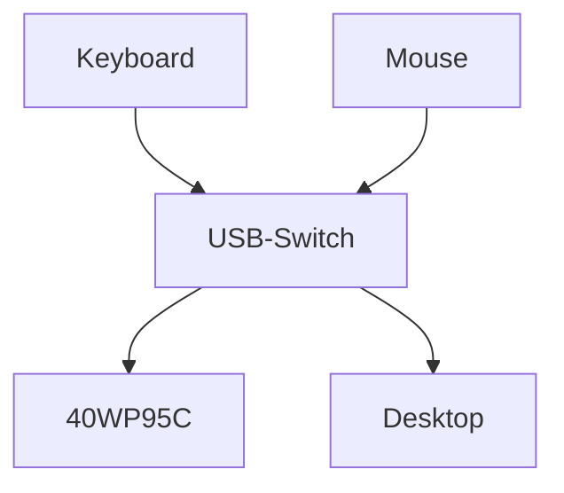

To be able to switch my peripherals between the desktop PC and the devices connected via USB-C to my LG 40WP95C I use an (HDMI/)USB-switch,

```mermaid
graph TD;
    Keyboard-->USB-Switch;
    Mouse-->USB-Switch;
    USB-Switch-->40WP95C;
    USB-Switch-->Desktop;
```
